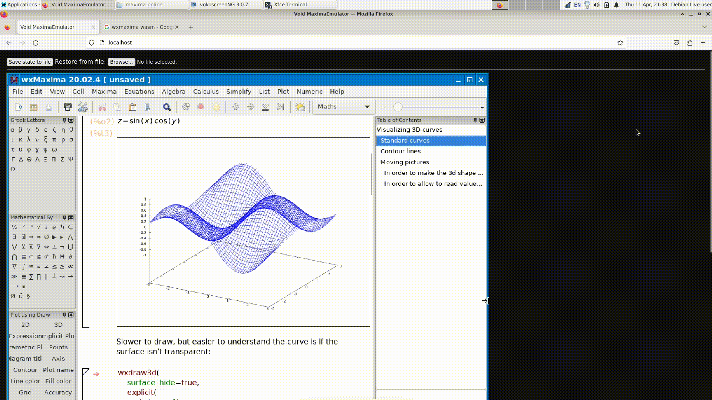

# WxMaxima in webrowser

## Howto setup and run the project

 1. Download this repo.
 2. Decompress the "images" folder from archives images.7z.001 ... images.7z.010
 3. Start a http server at port 80 from the repo. root
 4. Use browser to navigate to localhost. For example http://0.0.0.0
 
 
## Screenshot from the project

